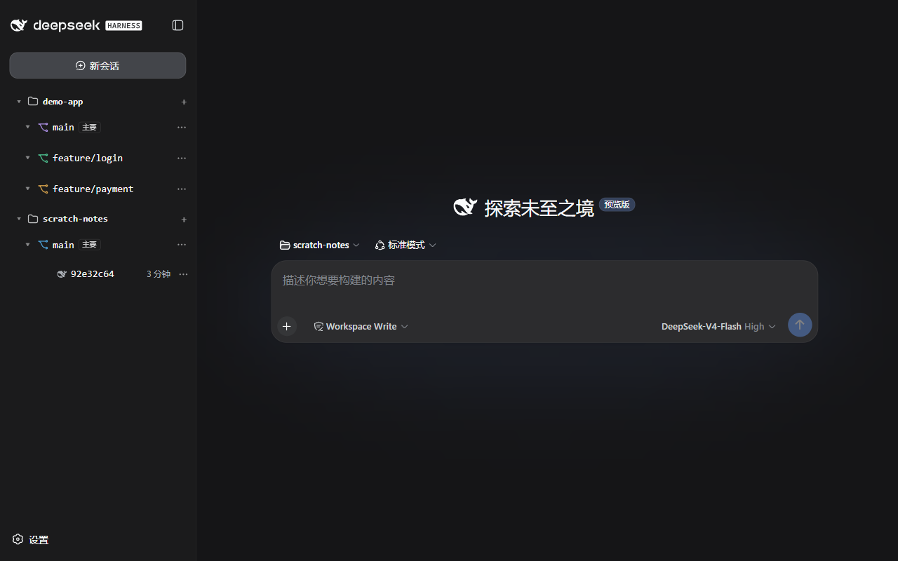
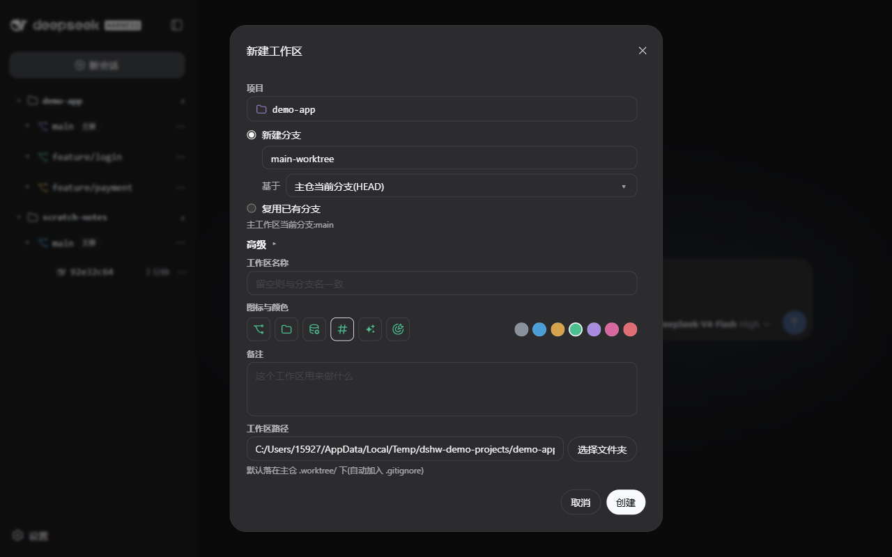
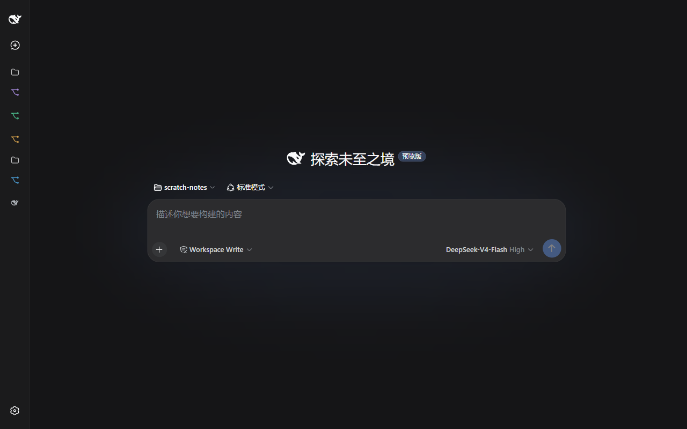

# dsh-worktree

[DeepSeek Harness (dsh)](https://github.com/deepseek-ai/deepseek-harness) 插件：为以「项目（导入目录）」为单位工作的 dsh 补上 **git worktree 并行开发**能力，并在此基础上提供**跨会话协作**原语与一整套**侧栏可视化工作流**。

- 🌲 项目分组侧栏：项目 → 工作区（主工作区 TAG、分支名、可定制图标/颜色）→ 会话，三级树一眼看清并行任务
- 🌿 可视化建 worktree：选分支（本地/远端）、自动落在主仓 `.worktree/` 并自动加入 `.gitignore`、备注、图标与颜色
- 🐋 会话状态一目了然：运行中像素矩阵动画、等待确认琥珀点、后台完成绿色对勾（订阅宿主实时推送，零轮询）
- 🍴 一键派生会话：聚焦交接 / 完整记录，从任意会话分叉新任务

| 侧栏：项目分组树 | 新建工作区 | 侧栏收起态 |
| --- | --- | --- |
|  |  |  |

## 功能路线

| 阶段 | 能力 | 状态 |
| --- | --- | --- |
| P0 | `worktree_list` / `worktree_add` / `worktree_remove` 三工具 | ✅ 已实现 |
| P1 | `session_list` / `session_read` 跨会话读取（基于 `ctx.sessionQuery`） | ✅ 已实现 |
| P2 | `project_fork`：worktree + 注册工作区 + 血缘登记 | ✅ 已实现 |
| P3 | `session_fork` 会话派生：完整交接（内核 fork）/ 聚焦交接（摘要种子） | ✅ 已实现 |
| P4 | 侧栏「项目分组视图」UI + 新建工作区全流程 + 工作区元数据（图标/颜色/备注） | ✅ 已实现 |
| Backlog | 配置继承（CLAUDE.md stub 播种、memory 注入）；归档视图（等宿主 unarchive API） | 待办 |

## 侧栏：项目分组视图

插件用自定义组件替换宿主侧栏的工作区列表（single slot 按 priority 遮蔽），渲染三级树：

```
📁 demo-app            ← 项目组头（git 主仓,可折叠）
   🌿 main [主要]      ← 主工作区(分支名 + TAG,图标/颜色可定制)
   🌿 feature/login    ← worktree(备注/图标/颜色随血缘持久化)
      🐋 修复登录跳转…  ← 会话(DeepSeek 图标 + 消息摘要 + 相对时间)
   🌿 feature/payment
📁 其他工作区           ← 未归组的工作区
```

- **实时状态占位**：会话行首列显示运行中（宿主 `StateDot` 像素矩阵动画）、等待用户确认（琥珀点，审批/计划/提问）、后台完成未读（绿色对勾，打开会话后清除）。数据来自 `ctx.sessions.list` 快照（`useSyncExternalStore` 订阅宿主 mux 帧推送），不依赖轮询。
- **消息摘要**：展开工作区时懒加载（插件 HTTP 路由批量提取各会话尾部内容），比标题更直观。
- **收起态 icon 列**：侧栏收起后自动切换紧凑视图——项目组/工作区/会话各留一枚图标（运行中为绿色），同一列居中对齐；hover 保留完整 tooltip，点击行为不变。
- **两级折叠**：项目组与工作区均可收起，状态持久化（localStorage）。

### 新建工作区

侧栏项目组 `+` 打开 Modal，全流程可视化：

- **分支来源双选**：`新建分支`（新分支名 + 「基于」任意本地/远端分支，默认主仓 HEAD）/ `复用已有分支`（直选；已被其他 worktree 检出的分支自动禁选并标注）。
- **高级区**：工作区名称（留空与分支一致）、图标与颜色（6 种 icon × 7 色，与重命名 Modal 同一套）、备注、工作区路径（默认 `<主仓>/.worktree/<分支名>`，系统目录选择器一键改选）。
- 路径落在主仓 `.worktree/` 下时自动追加进主仓 `.gitignore`。
- 创建 = `git worktree add` + 注册 dsh 工作区 + 血缘登记，三步原子完成（git 失败即中止，注册失败不回滚已建 worktree，结果体分步报告）。

### 工作区管理

行内菜单：新建会话、重命名（含图标/颜色定制）、设置备注、移除工作区记录（不动磁盘目录）；右键行 = 同一菜单。备注与图标/颜色持久化在血缘边，hover tooltip 即时可见。

### 会话派生

会话行菜单「派生分支」弹 Modal 二选一：**聚焦交接**（机械摘要种子，新会话轻装上阵）/**完整对话记录**（内核 fork，完整上下文）。

### 归档过滤

归档的会话自动从分组树隐藏（数据仍完整保留）；宿主暂无 unarchive API，归档查看视图待官方接口后启用。

## 安装

```sh
dsh plugin --profile <profile-name> add dsh-worktree
```

或手动方式：在 `$DSH_HOME/profiles/<name>/package.json` 的依赖中加入本包，并把 `dsh-worktree` 追加进 `cordis.patch.yml` 的 insert 列表（本仓库根已附带现成的 patch 文件）。

## 开发

```sh
npm install
npm run typecheck   # tsc --noEmit
npm run build       # 输出到 lib/
npm test            # 单测（node --test）
```

## 工具说明

### worktree_list

枚举仓库全部 worktree。参数：

- `repoPath`（可选）：仓库路径，默认当前工作目录。

### worktree_add

创建新 worktree。参数：

- `path`（必填）：新 worktree 目录。
- `branch`（必填）：分支名；`createBranch=true` 时为新建分支名。
- `createBranch`（可选，默认 true）：是否新建分支并检出。
- `baseRef`（可选）：新建分支时的起点（commit/分支/tag）。
- `repoPath`（可选）：源仓库路径。

### worktree_remove

删除 worktree。存在未提交内容时需显式 `force=true`。参数：

- `path`（必填）：worktree 目录。
- `force`（可选）：丢弃未提交内容强制删除。
- `repoPath`（可选）：源仓库路径。

### session_fork

从源会话派生新会话,并在 `~/.dsh/session-lineage.json` 登记父子边。参数:

- `sourceSessionId`（必填）：源会话。
- `mode`：`full`（默认,完整交接——内核 `SessionStore.fork`,与 Web UI 消息分支按钮同路径）/ `focus`（聚焦交接）。
- `summary`：`focus` 模式必填——先用 `session_read` 读源会话,提炼摘要传入,作为新会话的首条种子消息。
- `boundary`：`full` 模式可选,事件 seq 锚点(缺省回退到最后一个完成 turn)。
- `newSessionId`：可选自定义子会话 id。

### session_list

列出 harness 最近会话(含历史持久化)。参数:`limit`(默认 20)、`cwdContains`(按工作目录过滤)。

### session_read

读取一个会话内容。参数:`sessionId` 必填、`mode`(`tail` 默认末尾窗口 / `full` 全部)、`maxChars`(默认 12000)。只读,不唤醒源会话。依赖 profile 提供 sessionQuery 服务,缺席时报可读错误。

### project_fork

fork 项目三连:git worktree(新分支)→ 注册进 dsh 工作区 → 血缘登记(分组视图数据源)。参数:`name` 必填(兼作分支名)、`sourceRepoPath`、`worktreePath`、`baseRef`、`title`。注册/血缘失败不拆除已建 worktree,结果体如实分步报告。

## HTTP 路由（侧栏 UI 后端）

| 路由 | 作用 |
| --- | --- |
| `POST /dsh-worktree/repo-info` | 分支清单（本地/各远端）+ 当前分支 + 被占用分支 + origin 短名 |
| `POST /dsh-worktree/worktree-create` | `git worktree add` 全链路 + 注册 + 血缘（含备注/图标/颜色） |
| `POST /dsh-worktree/workspace-note` | 工作区元数据写回（备注/图标/颜色，空串清除） |
| `POST /dsh-worktree/lineage` | 批量读取工作区血缘（分组/分支名/元数据展示） |
| `POST /dsh-worktree/session-summaries` | 会话消息摘要批量懒加载（尾部窗口提取） |
| `POST /dsh-worktree/session-fork` | 会话派生（聚焦交接 / 完整记录），供侧栏动作调用 |

## 设计备忘

- 本插件不修改 dsh 主仓任何行为，纯增量挂载（Cordis 微内核扩展点机制）。
- 血缘关系（worktree ←→ 源仓库）当前持久化在 harness home 的 `worktree-lineage.json`（原子写，接口收窄可替换为 `ctx.storage` KV form）。设计取舍见 docs/plan-P1-P2.md。
- 会话按 `cwd` 归属到工作区（`workspaceIds` 仅为兜底），不依赖 attach 时序；归档集合来自 `workspace.list` 的 registry-global 数据。
- 执行 git 一律走 `child_process` 直连并遵守工具取消信号（`exec.signal`），不经 shell 服务，行为可预测；Windows 下对 git 可执行文件做绝对路径探测（`where` → 注册表 → 常见位置），规避「相对命令名 + cwd」触发的 `ENOENT`。
- 侧栏组件订阅宿主 `sessions.list` 快照（ObservableSnapshot + `useSyncExternalStore`）获取实时 running/completed 状态，10s 轮询仅为树结构兜底刷新。
